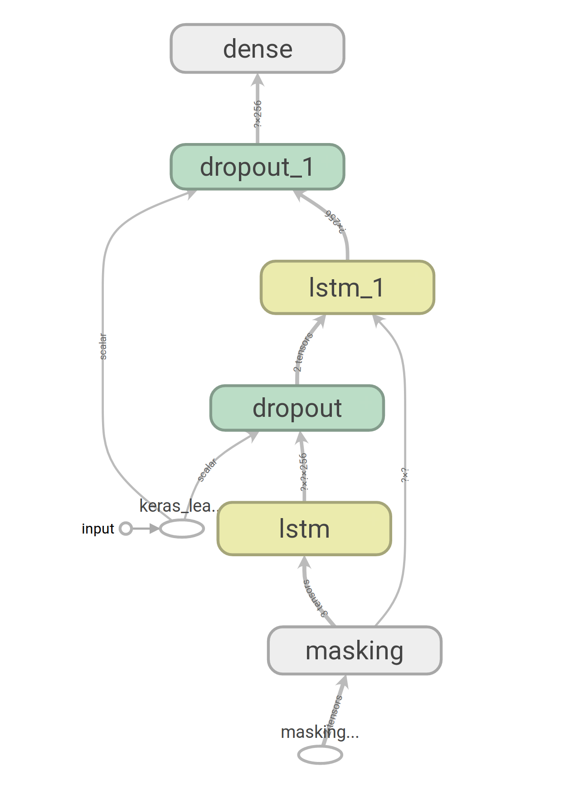

# Determining Fake News
[Insert blurb about relevancy]

### Model Architecture



```
_________________________________________________________________
Layer (type)                 Output Shape              Param #   
=================================================================
masking (Masking)            (None, None, 300)         0         
_________________________________________________________________
lstm (LSTM)                  (None, None, 256)         570368    
_________________________________________________________________
dropout (Dropout)            (None, None, 256)         0         
_________________________________________________________________
lstm_1 (LSTM)                (None, 256)               525312    
_________________________________________________________________
dropout_1 (Dropout)          (None, 256)               0         
_________________________________________________________________
dense (Dense)                (None, 2)                 514       
=================================================================
Total params: 1,096,194
Trainable params: 1,096,194
Non-trainable params: 0
_________________________________________________________________
```

# Installation Instructions
## Prereqs
1. Clone the repository.
2. `pip install -r requirements.txt`
3. `python spacy download en_core_web_lg`

## Training the model
Run `python lstm.py` using a GPU.

## Running the front-end
1. Run `python app.py` or `flask run`.
2. Go to `http://localhost:5000/`