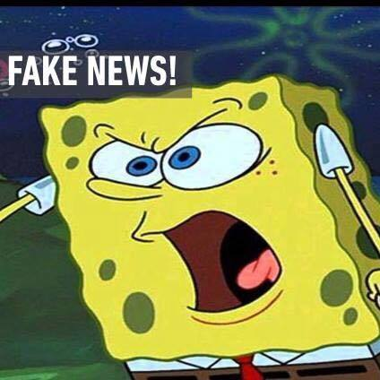
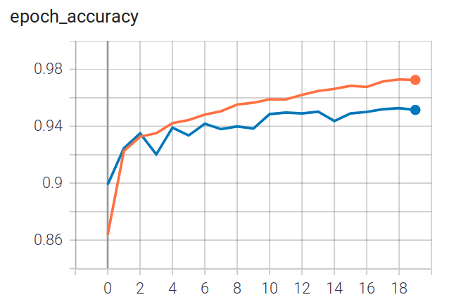
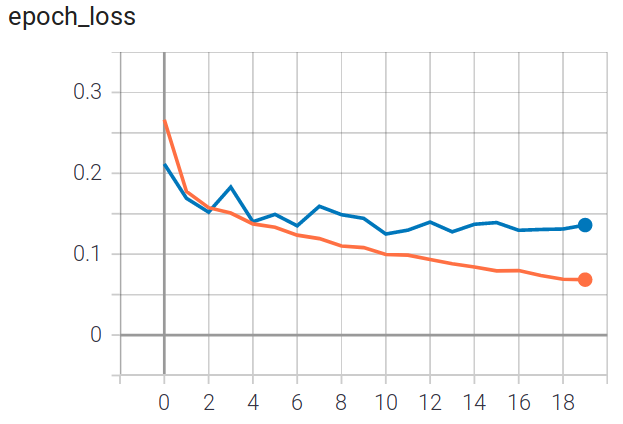
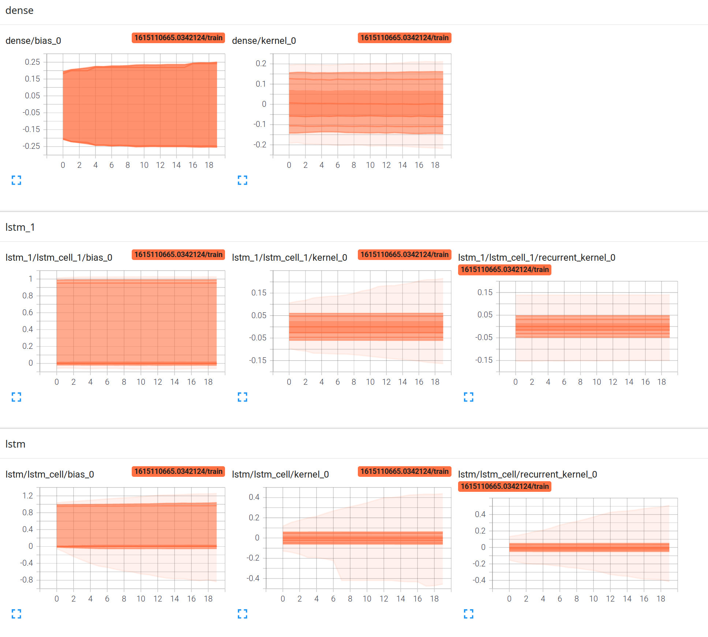

# Determining Fake News

<figure class="image">
  
  <figcaption>Spongebob: Fake news! Credits: my good friend Casper Guo.</figcaption>
</figure>

<br/>

Media has always been a tool of the ones with political power to manipulate the masses. Given the power dynamic between the media press and the readers, it is unfortunately quite easy to circulate fake news in the media, in a high-quality form that makes them indistinguishable from real news to the reader. The presence of fake news diverts the readership from real information that need to be circulated into the society at large, such as fact-based political news for making informed choices, real facts about safe public health practices, etc. As fake news becomes more “real”, it is essential that there be a reliable program that can tell the reader whether a news is real or fake for them to perceive the media accurately, especially today when accurately informing people on safe public health practices and vaccine facts are quintissential.

# Installation Instructions
## Prereqs
1. Clone the repository.
2. `pip install -r requirements.txt`
3. `python spacy download en_core_web_lg`

## Training the model
Run `python lstm.py` or `python lstm_t.py` (for titles only) using a GPU. (Note: This step is optional as pre-trained models are included)

## Running the front-end
1. Run `python app.py` or `flask run`.
2. Go to `http://localhost:5000/`

# Technical Details
## Training Data and Preprocessing

The training data includes over 50k news articles from three different datasets

1. https://www.kaggle.com/clmentbisaillon/fake-and-real-news-dataset?select=Fake.csv 

2. https://www.kaggle.com/nopdev/real-and-fake-news-dataset

3. https://www.kaggle.com/c/fake-news/data

The details for the preprocessing are in `preprocessing.py`. The procedure involves first tokenizing the article (or title), padding the length to 1000 words (for body) and 54 words (for title), and using spaCy to generate 300-dimensional word vectors. This process is done in parallel on the CPU to increase performance.

The data from all three datasets are then shuffled and split 70-30 into training and validation sets.

## Model Architecture


```
_________________________________________________________________
Layer (type)                 Output Shape              Param #   
=================================================================
masking (Masking)            (None, None, 300)         0         
_________________________________________________________________
lstm (LSTM)                  (None, None, 256)         570368    
_________________________________________________________________
dropout (Dropout)            (None, None, 256)         0         
_________________________________________________________________
lstm_1 (LSTM)                (None, 256)               525312    
_________________________________________________________________
dropout_1 (Dropout)          (None, 256)               0         
_________________________________________________________________
dense (Dense)                (None, 2)                 514       
=================================================================
Total params: 1,096,194
Trainable params: 1,096,194
Non-trainable params: 0
_________________________________________________________________
```

## Training and Other Info
How this model is trained is specified in `lstm.py` and `lstm_t.py`. Some details of the training process for the pre-trained models are logged by Tensorboard and shown below.
<p float="left">
  
   
</p>
The distribution of the model parameters are shown below.  


